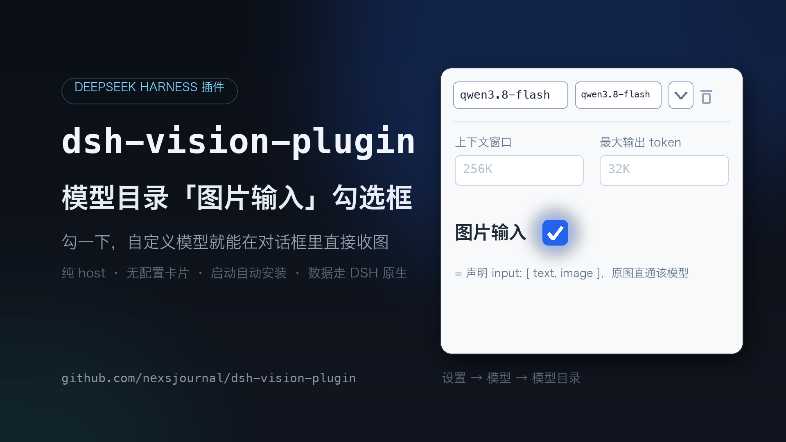
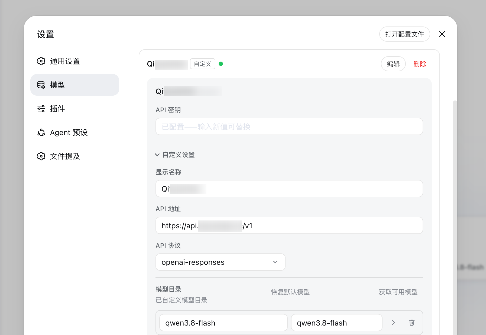

# dsh-vision-plugin

**给 DSH 的模型目录补上「图片输入」声明勾选框——勾一下，自定义模型就能在对话框里直接收图。**

## 它解决什么问题

DSH 的 host 端**原生支持**给自定义模型声明 `input` 模态（`dsh-llm-pi-ai` 会读取模型条目上的 `input: ["text","image"]`，并据此决定是否把原图直通给该模型；没声明 `image` 的模型收到图会直接报"不支持图片输入"）——但「设置 → 模型 → 模型目录」的 UI 一直没有暴露这个声明的入口。

本插件在**每次 DSH 启动时**幂等地给模型页装上这个入口：

- 模型目录里每行点 `>` 箭头展开后，「最大输出 token」下方多一个「**图片输入**」勾选框；
- 勾选 = 给该模型写 `input: ["text","image"]`（走模型页自身的保存流程，存进 DSH settings）；取消勾选 = 清除该字段；
- 勾选后，在对话框选到该模型直接发图即可（原图直通），不需要切模型、不需要任何工具。

## 在哪里勾选

「设置 → 模型」→ 选中你的自定义路由 →「模型目录」→ 点模型行右侧的 `>` 箭头展开：



步骤：

1. 「设置 → 模型」，选中要改的路由；
2. 「模型目录」里找到目标模型，点它右侧的 `>` 箭头展开（上图已展开 `qwen3.8-flash`）；
3. 勾上「上下文窗口 / 最大输出 token」下方的「**图片输入**」（= 声明该模型 `input: ["text","image"]`）；
4. 回对话框，模型选择器选到该模型，直接发图——DSH 原图直通该模型。

> 内置 provider 的模型通常已声明好模态，这个勾选框主要服务于**自定义路由**里的模型。

## 安装

前提：DSH 已部署（web profile）、`pnpm` 可用（`dsh plugin` 会转发 pnpm）。

```bash
npx @deepseek-ai/dsh plugin --profile web add github:nexsjournal/dsh-vision-plugin
```

**完全退出并重开 DSH**。重启后：

- 「设置 → 插件 → 插件列表」出现 `vision-plugin` 一行（已启用）；
- 「设置 → 模型 → 模型目录」：展开任意模型（点 `>` 箭头），「最大输出 token」下方出现「**图片输入**」勾选框；
- 「设置 → 插件 → 插件配置」**不会**出现本插件的卡片——本插件是纯 host 插件。

> 桌面端与网页版共用 web profile，装到 web 即两端都生效。
> 依赖说明：本包把 `@deepseek-ai/*` 声明为 optional peerDependencies，安装时不额外拉取，运行时由 profile 依赖树解析（标准部署自带）。

## 启用 / 停用

「插件列表」本身是只读的（DSH 核心 UI，所有插件都一样），启用/停用通过 profile 的补丁文件 `~/.dsh/profiles/<profile>/cordis.patch.yml` 控制：

**停用**（在顶层数组里加一个条目，然后重启 DSH）：

```yaml
- id: dsh-vision-plugin
  disabled: true
```

**启用**：删掉这个条目（或把 `disabled` 改为 `false`），重启 DSH。

停用后模型页勾选框补丁不再维护，但**已装上的勾选框和已保存的 `input` 声明继续有效**（数据走 DSH 原生，见下节）。

## 原理

1. **启动时打补丁**：插件 host 端在 DSH 启动、插件树挂载时，给 `dsh-client-ui-settings-models`（模型页）的编译产物补上勾选框（2 个字典键 + 1 个勾选框 JSX，共约 20 行）。幂等：已打过就跳过；锚点不匹配（DSH 升级改了页面结构）就跳过并记警告日志，**不会写坏文件**。补丁只动模型页这一个文件，不注册任何卡片。
2. **数据完全走 DSH 原生**：勾选只改模型条目上的 `input` 字段（settings 的 `llm-pi-ai` 命名空间，模型页自己的保存流程）。host 端 `dsh-llm-pi-ai` 原生读取该字段：`listModels/resolveModel` 把它暴露为 `inputModalities`，发图时若模型没声明 `image` 会直接报"不支持图片输入"。所以插件停用/卸载都不影响已保存的声明继续生效。

## 常见问题

| 现象 | 处理 |
| --- | --- |
| **模型页展开后没有「图片输入」勾选框** | 跑 `vision_status` 看 `modelsImageInputCheckbox`：`skipped>0` 说明 DSH 升级改了模型页结构、锚点不匹配（插件不会写坏文件），等插件新版适配；页面需要**硬刷新**（Cmd/Ctrl+Shift+R） |
| **勾选了图片输入，发图还是报"不支持图片输入"** | 确认勾的是**当前选中**的那个模型；改完勾选要等模型页保存（离开/重进模型页会触发）；`vision_status` 确认插件在启用状态 |
| **停用插件后勾选框/声明还在** | 正常——数据走 DSH 原生（`input` 字段存在 settings），停用只停止补丁维护 |
| **插件配置里没有本插件的卡片** | 正常——本插件是纯 host 插件，**不提供卡片** |

## 限制

- 补丁针对 `dsh-client-ui-settings-models` 0.1.0-rc.6 的编译产物；DSH 大版本升级改了模型页后勾选框会消失（插件记警告日志、不写坏文件），需插件新版适配。
- 生效的前提是该路由的端点**真的能处理图片**（勾选只是声明，DSH 不会替端点识别）。

## 附：BYO 视觉中继（附带能力）

插件历史版本的核心是一条 BYO（自带端点）视觉中继：host 端注册 `vision` provider + 4 个工具，当你的端点模型**不支持**图片直通时，把对话转发到第三方多模态 OpenAI 兼容端点识别（图片转 base64，非流式单次请求）。

- 工具：`vision_analyze`（按需识别图片文件）、`vision_status`（状态自检）、`vision_test`（端点连通测试）、`vision_configure`（对话里热配置）；
- 配置：Base URL / 模型 / API Key 三项，通过 `vision_configure` 或环境变量 `DSH_VISION_*` 热配置，不内置任何端点与密钥；
- 配好后模型选择器出现 `vision`（切过去发图 = 端点代识别），不配则完全静默，不影响勾选框功能。

## 目录结构

```
dsh-vision-plugin/
├── package.json          # dsh.bundle 元数据（纯 host，无 dsh.client）+ optional peers
├── cordis.patch.yml      # 组合补丁：插入 dsh-vision-plugin 行
├── lib/
│   └── index.js          # Host 半：模型页勾选框补丁（核心）+ BYO 视觉中继（附带）
├── docs/
│   └── models-image-input.png  # README 示意图（设置 → 模型 → 模型目录）
├── README.md
└── LICENSE
```
